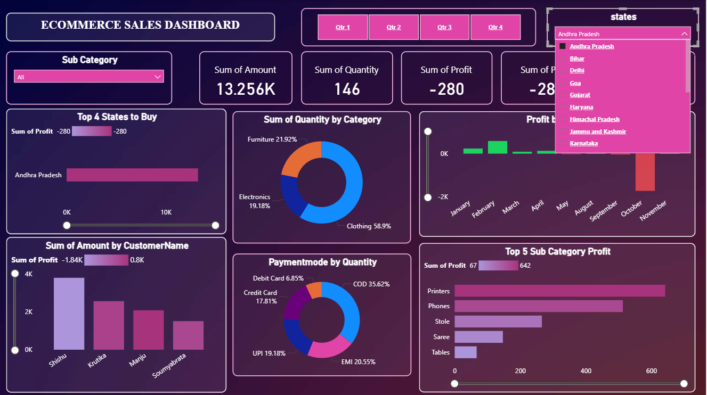

# 📊 E-commerce Sales Dashboard (Power BI)

## 📌 Overview

This repository contains an **E-commerce Sales Dashboard** developed in Power BI. The dashboard provides a comprehensive view of online sales performance, enabling businesses to track revenue, profit, customer behavior, and product performance through interactive visualizations.

-----

## ✨ Features

  - **Key Metrics Overview** – Total Sales, Profit, Average Order Value (AOV), and Quantity
  - **Regional Insights** – Sales by State to identify top-performing regions
  - **Customer Analysis** – Track high-value customers and their contribution
  - **Category & Sub-Category Performance** – Identify best-selling and least-performing products
  - **Payment Mode Analysis** – Understand customer preferences across COD, UPI, Cards, EMI, etc.
  - **Profit Trends by Month** – Seasonal sales and profit variations
  - **Interactive Filters** – Slice data by **Quarter** and **State** for deep insights

-----

## 🛠️ Tools Used

  - **Power BI Desktop** – Data visualization and dashboard creation
  - **Excel / CSV Data Source** – Input sales dataset
  - **DAX** – For calculated measures and KPIs

-----

## 📷 Dashboard Screenshots

### Dashboard View 1


### Dashboard View 2

-----

## 🚀 How to Use

1.  Clone this repository:
    ```bash
    git clone https://github.com/kondukarthik/Ecommerce-sales-analysis-using-power-bi-dashboard.git
    ```
2.  Open the `Ecommerce sales dashboard project.pbix` file using **Power BI Desktop**.
3.  Connect to the provided dataset (`Orders.csv`, `Details.csv`) or replace it with your own sales data.
4.  Explore insights with interactive filters and visualizations.

-----

## 📈 Insights Gained

  - Maharashtra, Madhya Pradesh, and Uttar Pradesh lead in overall sales.
  - Clothing contributes the highest sales volume among categories.
  - COD is the most preferred payment mode.
  - Printers and Bookcases show strong profitability, while some sub-categories underperform.
  - Seasonal variations affect profitability, with notable peaks in **January, February, and December**.

-----

## 📌 Future Enhancements

  - Integration with live databases for real-time updates
  - Adding customer segmentation and churn analysis
  - Forecasting future sales using AI/ML models

-----
